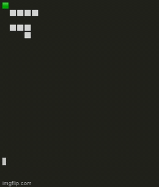
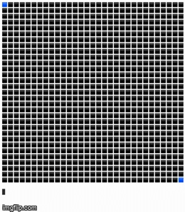

Maze makers, crackers, and games - A*, BFS, DFS, Heuristic, Binary Trees

Try to solve the maze! Generated with a random binary tree.

  

Watch the A* algorithm crack a random DFS generated maze.

  

Check out the other maze solvers - BFS, DFS, and Heuristic.